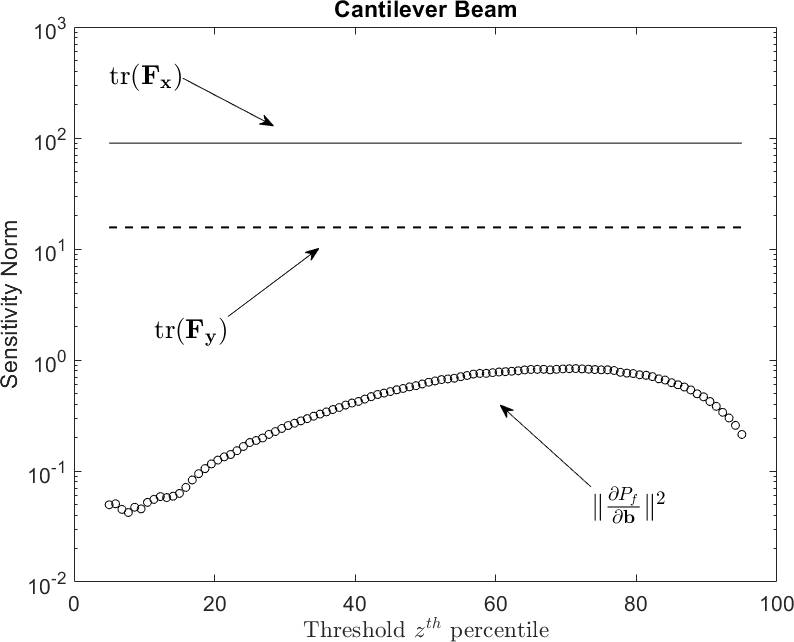

# An information upper bound for probability sensitivity 
# 1. Introduction 


Consider a function $\bf y = h(x)$ where the input is uncertain. Probabilistic sensitivity analysis identifies the influential inputs to guide decision makings. Of practical concern is the probability that the output would, or would not, exceed a threshold, and the probability sensitivity depends on this threshold that is often uncertain. We present a mathematical proof that the information theoretical metrics provide upper bound for the probability sensitivity, i.e. 


$$\begin{array}{l}
\\
{\left\|\frac{\partial P_{{\mathrm{f}}} \left(\mathbf b,z\right)}{\partial \mathbf b}\right\|}^2 \le {\mathrm{t}\mathrm{r}}\left\lbrace \mathbf F\left(\mathbf b\right)\right\rbrace \\
\end{array}$$


where $\bf b$ is the parameter of the uncertain inputs and $P_\text{f}$ is the failure (or acceptance) probability that depends on the threshold $z$. The matrix $\bf F$ is the symmetric semi-positive definite Fisher Information Matrix (FIM) . The proof is elementary, relying only on a special version of the Cauchy-Schwarz inequality called Titu’s lemma. The proof presented makes no assumption of the functional form of the probability measure. Nevertheless, in the simple but common case where the probability of interest is simply the (complementary) cumulative distribution function, the bound for the perturbation of the probability by the K-L divergence is found to be a consequence of the well-known Pinsker’s inequality. The details of the mathematical proof can be found in the paper. 

Using the information processing inequality, the sensitivity bound for the probability has been extended to the Fisher information of both the uncertain input and output. The Fisher information of the input is shown as the weaker bound. The extended inequality has been demonstrated with a few numerical examples, where an efficient Monte Carlo based Likelihood Ratio method has been applied for the sensitivity computation. 

# 2. Demonstration examples 
  
## 2.1 Case-1 

Case 1 considers a trivial function $y=x$, where the random variables follow the Normal distribution, i.e. $y=x \sim \mathcal{N}(\mu,\sigma^2)$


## 2.2 Case-2


Case-2 considers a simple harmonic oscillator (SHO), e.g., a mass on spring or a simple pendulum


This is subject to a harmonic driving force, its frequency response function can be described non-dimensionally as 


$$\begin{array}{l}
\\
H={\left\lbrack 1-\beta^2 +i2\zeta \beta \right\rbrack }^{-1} \\
\end{array}$$


where $\beta = \omega/\omega_n$ is the ratio between the forcing frequency $\omega$ and the natural frequency of the SHO $\omega_n$, and $\zeta$ is the non-dimensional viscous damping factor. In this example, both $\beta$ and $\zeta$ are considered to be random and follow the Normal distribution.  

The function used for this case to get the response is [design_1dof.m](/code/design_1dof.m)


## 2.3 Case-3


Case-3 considers a cantilever beam that is subject to a bandlimited white noise excitation, where only the first three modes are excited, at the middle span position. 


In this case, the outputs of interest are the peak r.m.s acceleration and strain responses along the beam, where the r.m.s response, for both acceleration and strain, can be obtained as 


$$\begin{array}{l}
\\
y\left(\xi \right)=\sqrt{\sum 2S\left(\xi ,\omega \right){\mathrm{d}}\omega }\\
\end{array}$$


where $S$ is the response spectrum. The function used for this case to get the response is [design_cb.m](/code/design_cb.m)


# 3. Call_TEDS
To implement the numerical case studies, you need to download the sensitivity code of [TEDS](/../../../../longitude-jyang/TEDS-ToolboxEngineeringDesignSensitivity) from a different repository. The following scripts then calls TEDS to compare the failure probablity sensitivity againt Fisher information. 

One example is given for case 3 for the cantilever beam. 

```matlab:Code
caseNo = 3
```


```text:Output
caseNo = 3
```


```matlab:Code
[yExLevel,RandV,Opts] = call_case (caseNo); 
[Fraw,PfSen_v_norm,ListPar]   = call_TEDS (Opts,RandV,yExLevel,caseNo);
```


```text:Output
Monte Carlo Analysis Starts: ...
```


```text:Output
Analysis Completed:103.73[s]
Estimating Fisher: ...
Fisher EigenAnalysis Completed:0.11[s]
```

# 4. Display

```matlab:Code
figName = disp_case (Fraw,PfSen_v_norm,RandV,ListPar,Opts,yExLevel,caseNo)
```


```text:Output
figName = 'cantilever'
```


```matlab:Code
```




